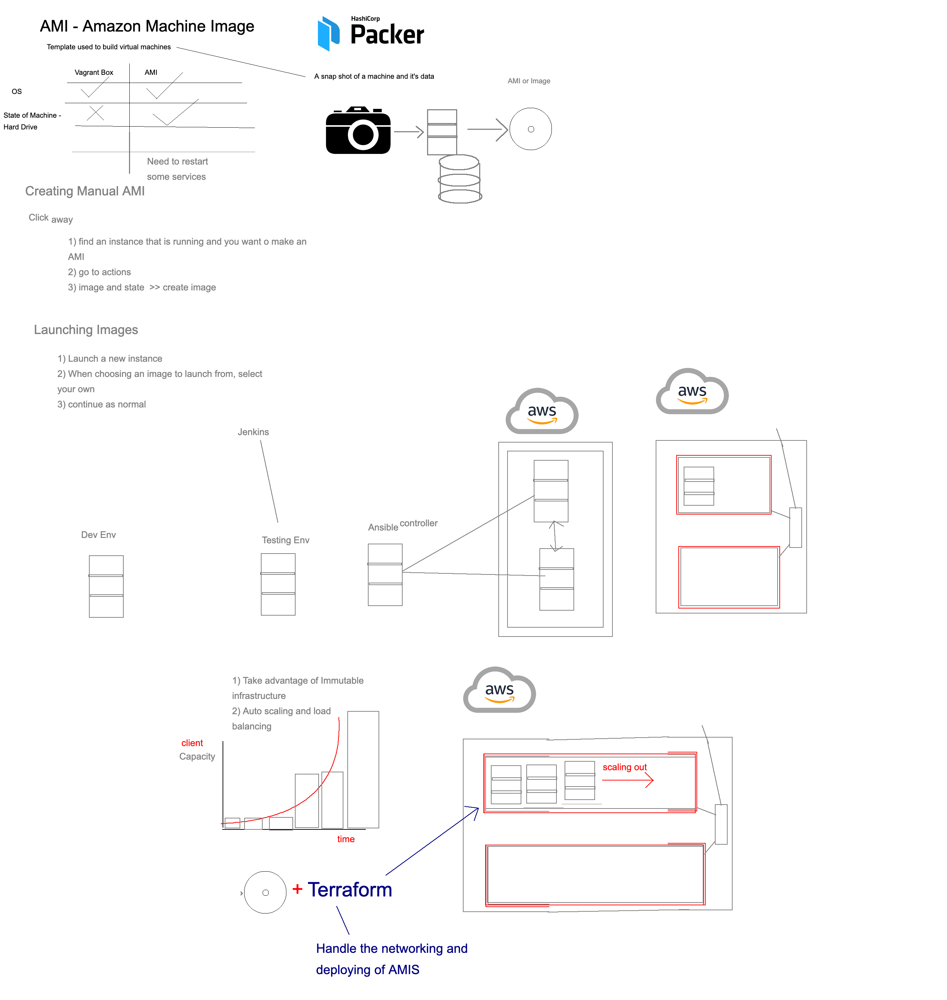

# Provision an AMI using Packer 
## Pre-Requisites
1. Install HashiCorp's 'Packer' using the instructions [here](https://learn.hashicorp.com/tutorials/packer/getting-started-install).
2. An AWS account, with permission to create AMIs and Instances
- (Optional) A code editor (you can write your playbook and json in here, then copy into your terminal, which avoids syntax errors)

3. an ansible controller AWS Instance, see this repo. 

## What is an AMI?


## Steps
###1. SSH into your Ansible Controller Instance 
###2. Install Packer on your Ansible Controller Instance (See link in pre-requisites)
###3. Create a file to contain packer files and then create an empty json file:

```bash
mkdir packer_files
cd packer_files/
touch packer.json
#begin editing this file
sudo nano packer.json
```

###4. In this json file we will lay out the information to create an Amazon Machine Image

```json
{
  "variables": {
    "aws_access_key": "{{env `AWS_ACCESS_KEY`}}",
    "aws_secret_key": "{{env `AWS_SECRET_KEY`}}"
  },
  "builders": [
    {
      "type": "amazon-ebs",
      "access_key": "{{user `aws_access_key`}}",
      "secret_key": "{{user `aws_secret_key`}}",
      "region": "eu-west-1",
      "source_ami_filter": {
        "filters": {
          "virtualization-type": "hvm",
          "name": "ubuntu/images/hvm-ssd/ubuntu-bionic-18.04-amd64-server-20201026",
          "root-device-type": "ebs"
        },
        "owners": ["099720109477"],
        "most_recent": true
      },
      "instance_type": "t2.micro",
      "ssh_username": "ubuntu",
      "ami_name": "eng74-farah-provisioned-ami-packer-v5"
    }
],

  "provisioners": [
    {
      "type": "ansible",
      "playbook_file": "/etc/ansible/playbooks/app_provision_packer.yaml"
    }
  ]
}
```
#### Important Points: 
1. the `"ami_name"` needs to be unique to each AMI, if running this file multiple times to create many AMIs you will need to change the name

2. the  `"provisioners"` dictionary is where we link this packer file to any ansible provisioning files we have on the controller, so they are executed on creation of the instance. 

5. Save changes to the file using `CTRL X` then 'Y' then `ENTER`